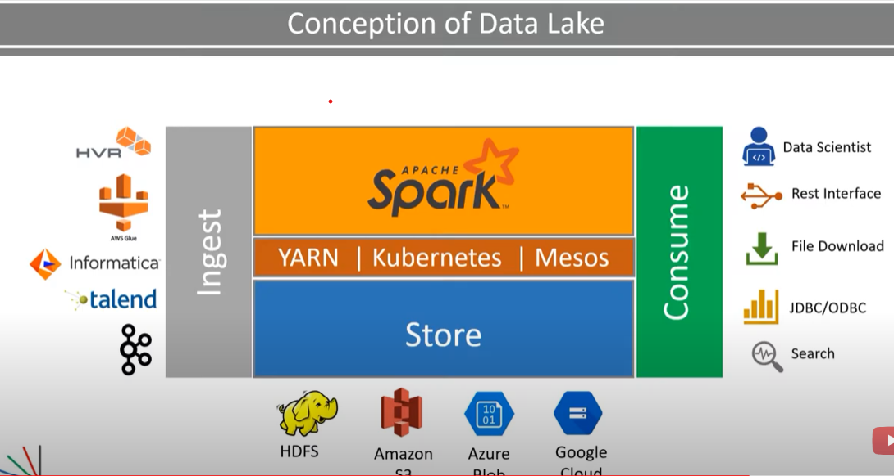

# Bigdata: 
It is a term for collection of large & complex datasets, which is difficult to be processed by traditional databases. Challenges includes capture, storage, search, transfer, analyze & visualization.  
The Characteristics of big data are Volume (Huge), Velocity (High) and Variety (Many). 

# HDFS
Horizontal Scalable
Low capital cost

# DataLake

