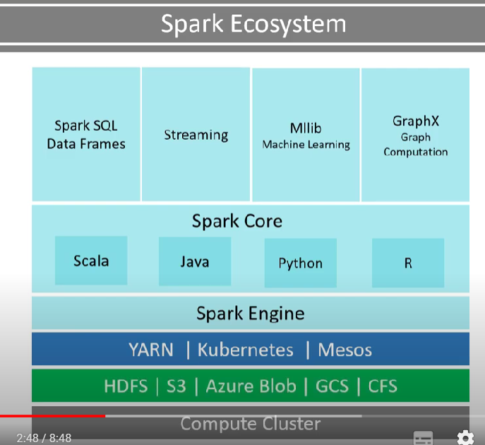

# Evolution of Distributed storage and processing
Industry Problems:
Huge Data Collection
Huge Data Ingestion into any system
Huge Data Storage
Huge Data Management
Huge Data Processing/Transformation
Huge Data Access/Retrieval

# Spark
Apache Spark is a powerful open-source processing engine built around speed, ease of use, and sophisticated analytics.

Two Layers:
1) DSL/Libraries/APIs (SQL dataframes, Streaming, Mlib, GraphX)
2) Spark Core (Spark Engine)
    Spark Engine runs on a hardware but not suppo

